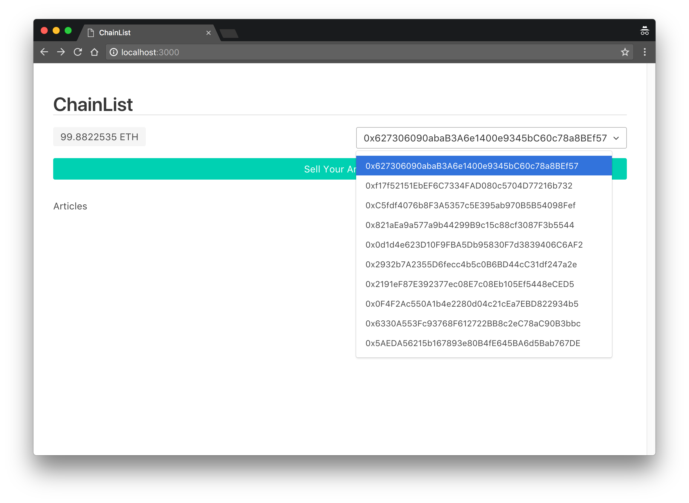
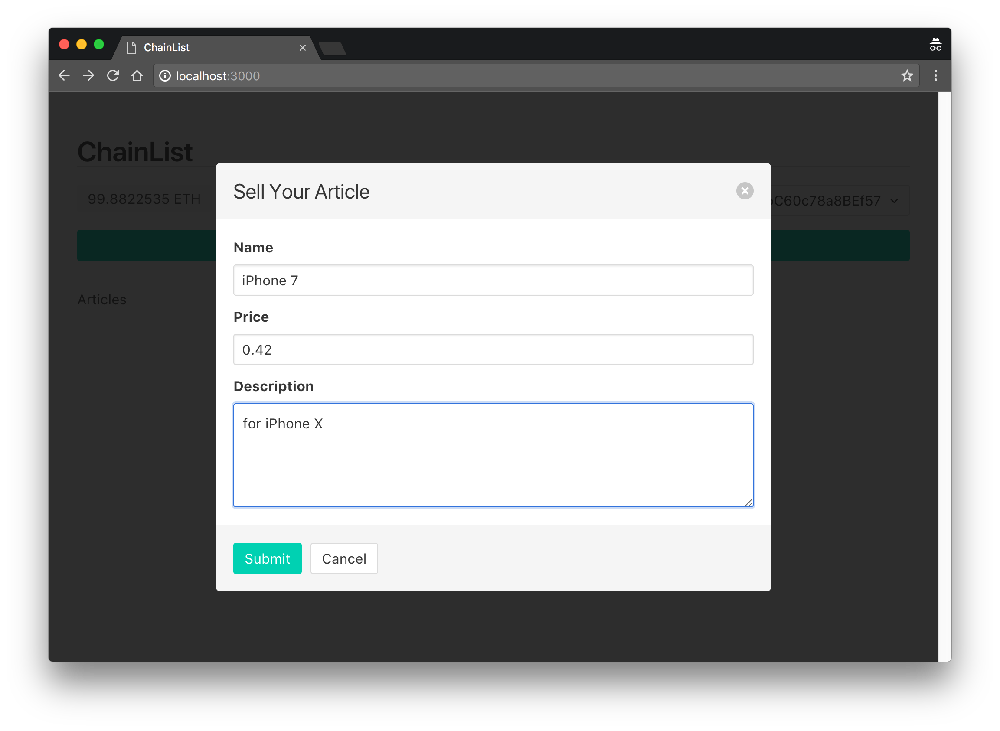
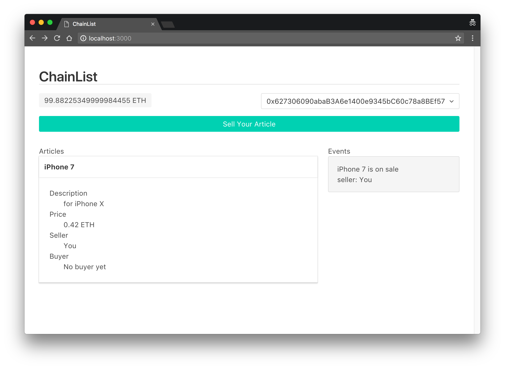
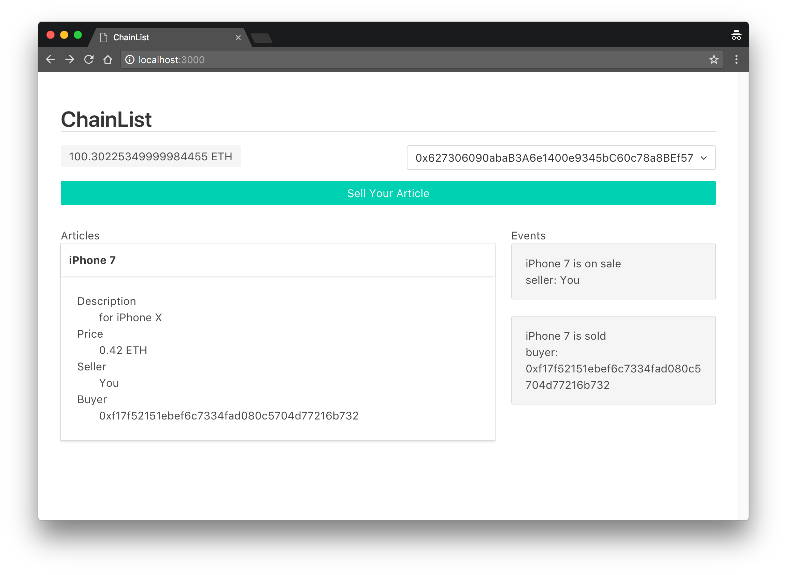

# ChainList
This is a course [project](https://github.com/chainskills/chainlist) and I made several improvements.

## Frontend
Re-wrote by using
- [React](https://github.com/facebook/react)
- [Redux](https://github.com/reactjs/react-redux)
- [Bulma](https://github.com/jgthms/bulma)
- [Web3-1.0-beta](http://web3js.readthedocs.io/en/1.0/index.html)

## Backend
- Upgrade to the latest [Truffle](https://github.com/trufflesuite/truffle) (4.0.4)

## Running
### 1. Start private Ethereum node by Truffle
```bash
truffle develop
```
### 2. Compile and deploy contract
inside truffle console
```
migrate
```
### 3. Start frontend project
```bash
yarn start
```

## Deployment
ChainList.sol is deployed to the rinkeby network, visit my [gh-pages](https://eric6356.github.io/chainlist/) with metamask to try it out.

## Screen Shots
  
  
  

